# 使用ServiceStage端到端构建部署网关服务

微服务API网关是微服务集群对外的边界，在微服务架构中扮演着重要的作用。  
API网关可以作为企业IT系统API的统一接入点，将所有的API聚合在一起，对外提供服务。在API网关上，可以添加统一的认证鉴权、监控、流控等公共能力，使得后端服务能否更加聚焦于自身的本质业务。

[EdgeService](https://docs.servicecomb.io/java-chassis/zh_CN/edge/by-servicecomb-sdk.html)是[ServiceComb-Java-Chassis](https://github.com/apache/servicecomb-java-chassis)框架提供的一个微服务API网关框架。用户可以基于EdgeService快速开发自己的微服务API网关。EdgeService具有如下优点：
- 高性能

  EdgeService基于ServiceComb-Java-Chassis，底层通信框架为Vert.x，默认工作于[Reactive](https://docs.servicecomb.io/java-chassis/zh_CN/general-development/reactive.html)模式，因此转发请求时性能损失较少。

- 治理和扩展能力

  EdgeService直接复用了ServiceComb-Java-Chassis的治理能力，并且在配置和使用方法和功能扩展方法上也与基于Java-Chassis开发的普通微服务相同。它可以被视为一个稍微特殊一点的Java-Chassis微服务。

- 基于契约的请求转发

  得益于ServiceComb微服务对OpenAPI的原生支持，EdgeService网关可以从Service Center中获取后端微服务的服务、版本、接口契约信息。因此如果后端服务的url符合一定的前缀格式，EdgeService网关可以自动确定请求应该转发给哪个版本的哪个微服务。例如，svcA服务的0.0.1版本有接口op1，之后svcA服务上线了0.0.2版本，增加了一个新接口op2。此时EdgeService会自动把调用op1的请求转发到0.0.1和0.0.2两个版本的svcA服务实例，而调用op2的请求只会被转发给0.0.2版本的svcA服务的实例。这个过程完全是自动进行的，用户不需要修改EdgeService网关的代码、配置，也不需要重启EdgeService服务的实例。

本文主要介绍使用ServiceStage的功能将EdgeService微服务网关打包为docker镜像，部署在云上，并将微服务接口暴露到外网的方法。

阅读本篇文档，您需要具备的基础知识和预先准备的内容包括：
- Java：了解Java语言编程知识
- maven：了解maven插件，能够使用mvn构建命令打包
- docker：了解Dockerfile的写法
- 华为云服务资源：需要ServiceComb引擎实例、CCE集群（节点绑定一个EIP）各一个，确保SWR镜像仓库服务可用。
- GitHub：需要一个GitHub账号，了解GitHub的fork操作

## Demo 说明

本文的Demo工程代码在[microservice-solution][]库的`edge-service`目录中，读者可以自行下载源码。

Demo中包含三个微服务，其调用关系如下图所示：
<p align="center">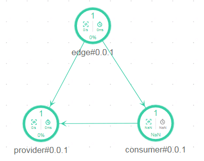<p>

- provider

  此服务是一个后端服务，只接收请求并返回响应。

- consumer

  此服务也是一个后端服务，可以接收请求，并调用provider服务。

- edge

  此服务是EdgeService服务，作为整个微服务集群的API网关服务转发请求。

## 构建前的准备工作

### 获取Demo代码

前往[microservice-solution][]库，点击页面右上角的“Fork”按钮，将demo代码库fork一份到自己名下：

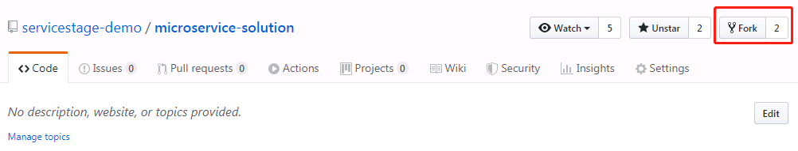

### 配置maven工程打包插件

在将微服务打成docker镜像包之前，首先要确保项目能够被打包成可执行jar包。
本项目打可执行jar包的方式是使用`maven-jar-plugin`插件设置classpath打可执行jar包，使用`maven-dependency-plugin`插件复制jar包所需的第三方依赖jar包。
pom文件中的插件配置如下所示，注意需要配置一个`main.class`属性来指向Main类（demo代码已经预先配置好了，用户可以不用修改）：
```xml
<plugin>
  <groupId>org.apache.maven.plugins</groupId>
  <artifactId>maven-dependency-plugin</artifactId>
  <executions>
    <execution>
      <id>copy-dependencies</id>
      <phase>package</phase>
      <goals>
        <goal>copy-dependencies</goal>
      </goals>
      <configuration>
        <outputDirectory>target/lib</outputDirectory>
      </configuration>
    </execution>
  </executions>
</plugin>
<plugin>
  <groupId>org.apache.maven.plugins</groupId>
  <artifactId>maven-jar-plugin</artifactId>
  <configuration>
    <archive>
      <manifest>
        <addClasspath>true</addClasspath>
        <classpathPrefix>./lib/</classpathPrefix>
        <mainClass>${main.class}</mainClass>
        <addDefaultImplementationEntries>true</addDefaultImplementationEntries>
        <addDefaultSpecificationEntries>true</addDefaultSpecificationEntries>
      </manifest>
      <manifestEntries>
        <Class-Path>.</Class-Path>
      </manifestEntries>
    </archive>
  </configuration>
</plugin>
```
最终target目录下有效的输出内容如下：
```
target/
  |-lib                                       // 第三方依赖所在目录
  \-helloworld-provider-0.0.1-SNAPSHOT.jar    // 可执行jar包
```
在打docker镜像时需要将这两部分内容都复制到镜像中。

### 准备Dockerfile文件

Dockerfile文件的内容如下，需要保证`helloworld-provider`、`helloworld-consumer`、`helloworld-edgeservice`三个工程的根目录下各有一份。
```Dockerfile
FROM openjdk:8u181-jdk-alpine

WORKDIR /home/apps/

COPY target/lib lib

COPY target/*.jar app.jar

RUN sh -c 'touch app.jar'

ENTRYPOINT [ "sh", "-c", "java -Djava.security.egd=file:/dev/./urandom -jar -Xmx128m app.jar" ]
```
这份Dockerfile使用OpenJDK 1.8的基础镜像，maven构建得到的lib目录和可执行jar包会被复制到镜像内的`/home/apps/`目录中。

## 通过ServiceStage构建部署服务

我们使用ServiceStage的云上工程功能来构建docker镜像包和部署服务。

### 创建云上工程流水线

// TODO: 工程目录变了，需要修改截图

1. 登录ServiceStage控制台，从左侧导航栏进入进入 持续交付 -> 工程，选择创建云上工程。

  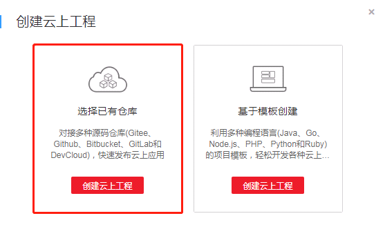

2. 配置代码来源，这里以GitHub为例。

  

  如果以前没有使用过这个功能的话，需要先新建授权。给新建的授权取一个名字，选择“使用Oauth授权”，浏览器会弹出一个新标签页跳转到GitHub，输入GitHub账号密码后即可创建成功。

  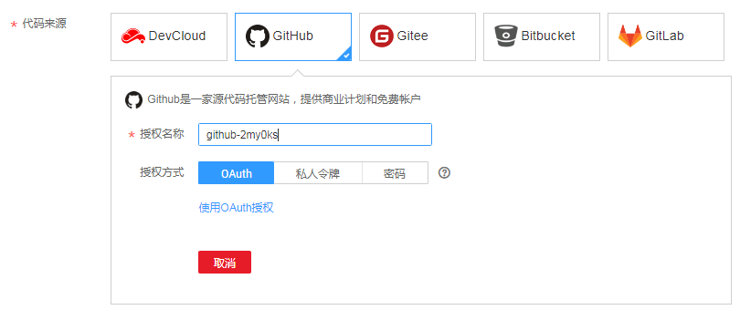

3. 配置构建环境，此处我们选择构建语言为Java，由于项目pom文件不在代码库的根目录下，所以需要在编译命令中先切换到对应maven工程的目录下面去，再执行`mvn clean package`命令。
截图中以构建provider工程为例，同样地，Dockerfile目录也需要修改为provider工程的目录。

  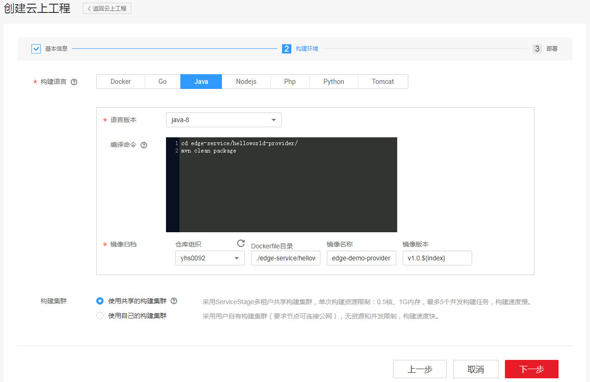

4. 选择一个CCE集群来部署微服务。注意选一个CSE引擎实例给微服务做对接。

  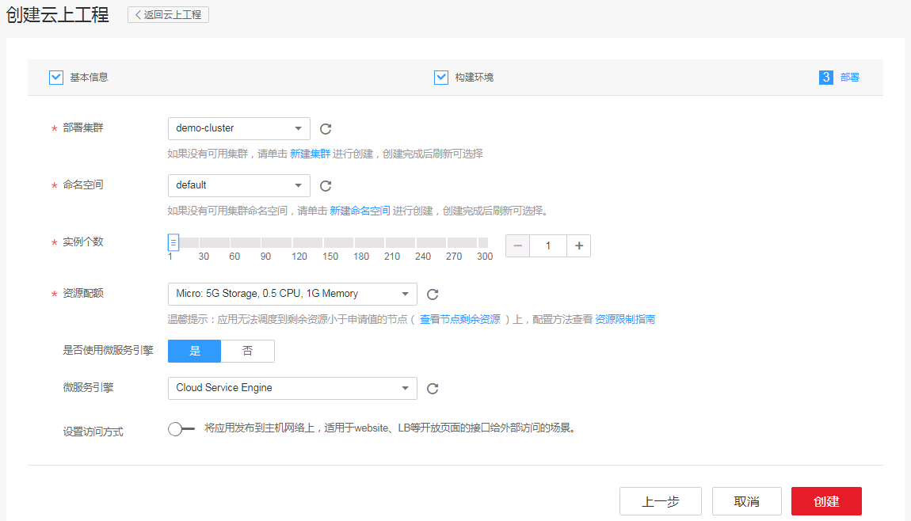

  点击“创建”让ServiceStage开始创建云上工程，这个过程包含了创建一条流水线，它包含了构建、发布等功能，在创建完成后会立即触发这条流水线运行一次。我们可以通过左边的导航栏前往 持续交付 -> 发布，查看流水线的状态。

  云上工程创建中：
  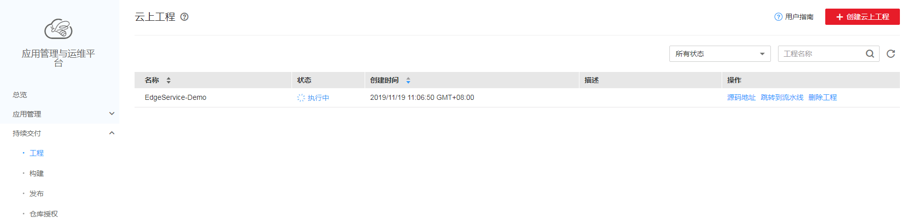

  流水线运行中：
  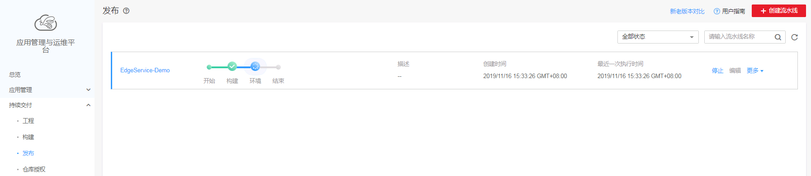

  待到流水线执行完成后，可以点击流水线名称进入详情页面，可以看到应用已经部署到CCE集群中了。**注意**：此时的provider服务还只能从CCE集群内访问。

  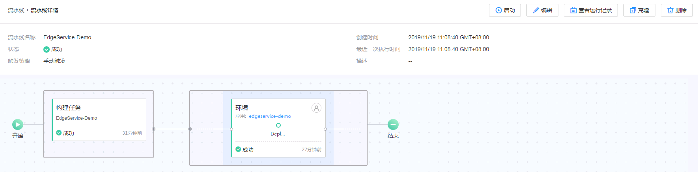

## 添加构建发布任务

前面我们创建的云上工程流水线还只能构建和发布provider服务，我们还需要在这条流水线中增加构建任务，将EdgeService网关，即`helloworld-edgeservice`工程也构建发布到CCE集群中。

### 添加EdgeService工程的构建任务

从ServiceStage页面左边的导航栏进入 持续交付 -> 构建，点击右上角的“基于源码构建”：

  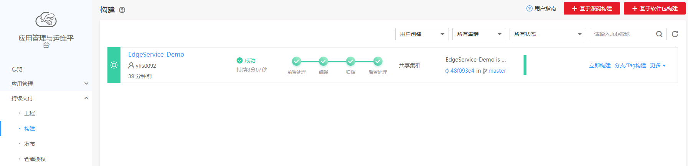

  参考上文，设置好构建任务的代码库：

  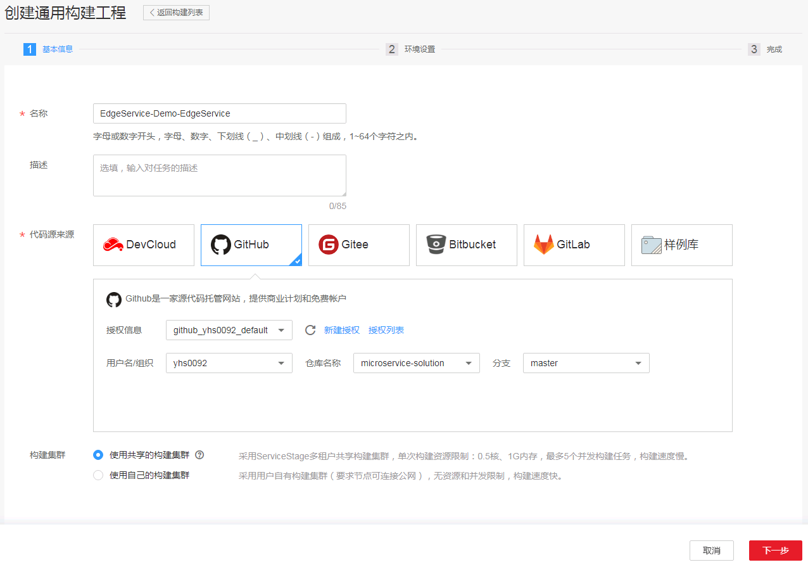

  点击“下一步”，构建模板选择“Maven”，归档方式选择“归档镜像编译”。“必填项参数配置”栏需要注意确保pom文件路径及Dockerfile路径对应的是代码库中`helloworld-edgeservice`工程的目录。

  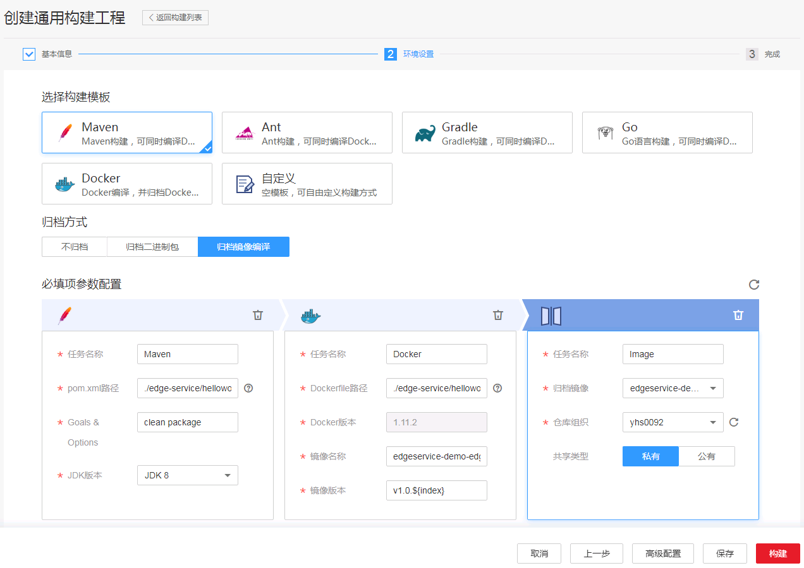

  点击“保存”以创建构建任务，可以在 持续交付 -> 构建 中看到新增的“EdgeService-Demo-EdgeService”构建任务，点击立即构建以触发它先执行一次，归档一个docker镜像包。

  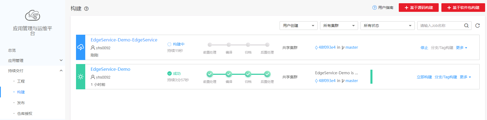

### 创建EdgeService服务的CCE应用

`helloworld-edgeservice`工程构建成功后，可以以此镜像创建网关服务的CCE应用了。从ServiceStage左侧导航栏进入 应用管理 -> 应用列表，点击页面右上方的“创建应用”，在应用类型中选择“ServiceComb”，框架选择“Java-Chassis”，运行环境选择“Docker”，配置如下图所示：

  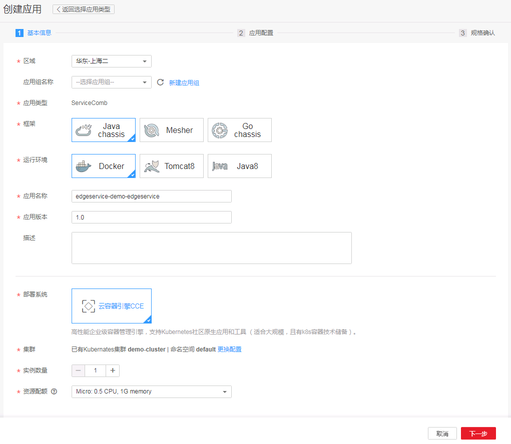

  点击下一步，在应用配置页面选择上一步构建好的EdgeService镜像，如下图所示：

  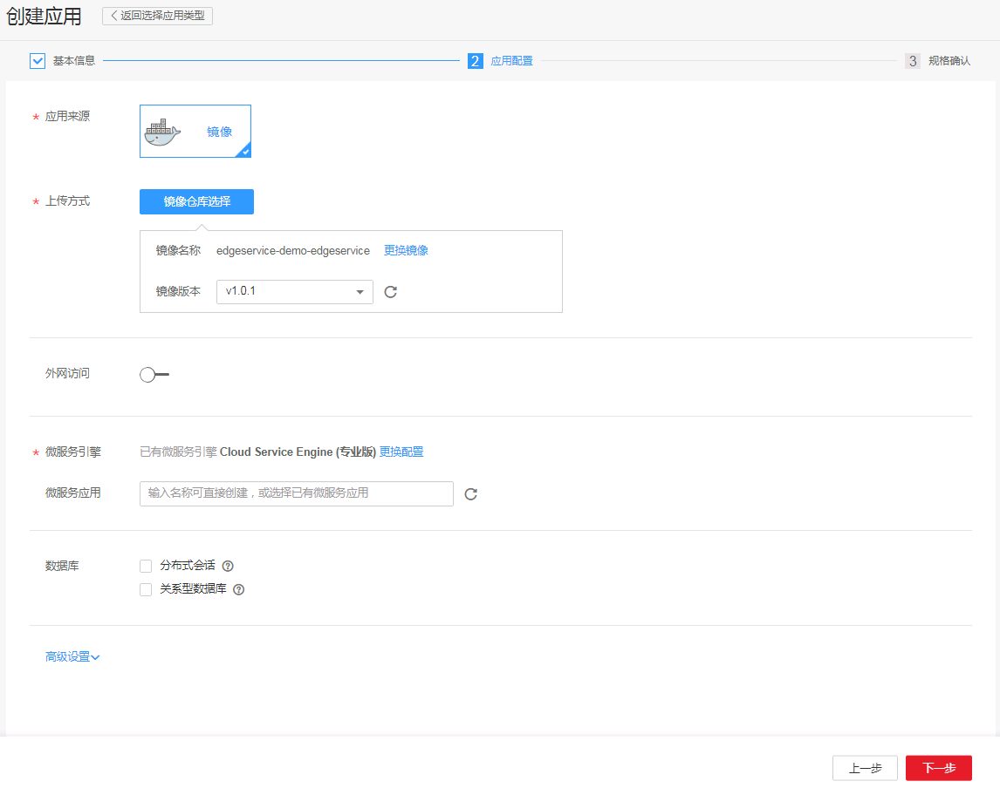

  点击下一步，确认，即可完成网关的部署。

### 添加构建、部署任务到流水线

从ServiceStage页面左边的导航栏进入 持续交付 -> 发布，点击进入`EdgeService-Demo`流水线的详情页，在页面右上角点击“编辑”，将前两部创建的构建任务及应用分别添加到“构建任务”和“环境”栏中，注意在“环境”中添加应用时，要选择与EdgeService应用匹配的构建任务和构建输出，即本小节第一步创建的`helloworld-edgeservice`工程的构建任务。如下图所示：

  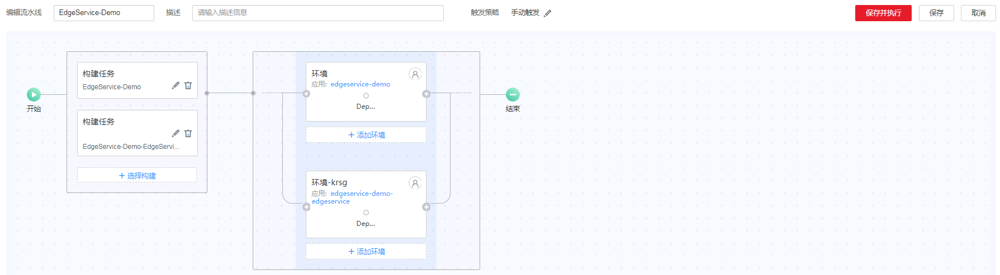

  点击保存并执行，触发流水线执行一次。

### 配置外网访问EdgeService

由于前面的步骤都没有将微服务暴露到外网，因此只能在CCE集群内部调用服务接口。现在需要把EdgeService服务暴露到外网上，以便用户可以从外网访问provider服务的接口。从ServiceStage左侧导航栏进入 应用管理 -> 应用列表，点击进入EdgeService应用的详情页面，选择“访问方式”，点击“添加服务”，访问方式选择“公网访问”，访问类型选择“弹性IP”（这要求用户有一个EIP并且已经绑定到CCE集群的节点上）。因为EdgeService服务在容器内监听的端口是8000，因此在“容器端口”栏填8000，访问端口可以由系统自动生成，点击确定把EdgeService暴露到集群之外。配置如下图所示：

  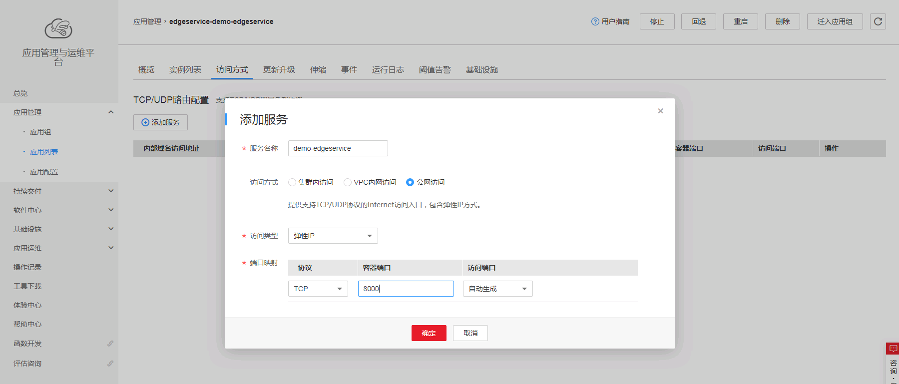

  点击确定，系统会自动分配一个外网端口映射给EdgeService应用的容器内端口上，如图：

  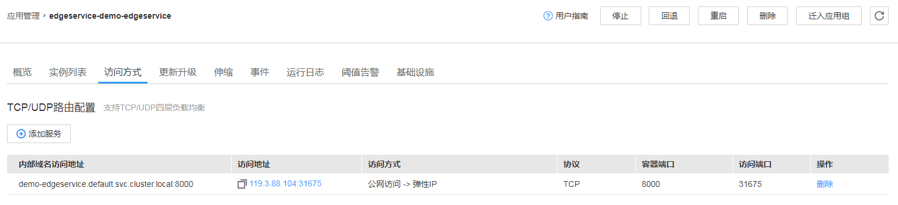

## 结果验证

至此，demo工程的provider和edge服务都部署到CCE集群中了，并且由用户可以从外网经过EIP访问EdgeService服务，从而调用微服务集群内provider的接口。如下图所示：


本文中EdgeService使用`DefaultEdgeDispatcher`转发请求到后端服务，这个dispatcher的优势在于，只要后端服务的url满足它的预设url格式（以微服务名称、版本范围为前缀，如 `/<serviceName>/<version>/*`），它就能自动进行请求转发，而无需进行任何其他的修改。关于EdgeService的具体信息可以参考 21天转型微服务实战营 中关于[EdgeService网关的课程][EdgeService网关课程]。

我们可以尝试用上文中的方法将demo中的`helloworld-consumer`工程同样部署到CCE集群中，然后直接通过EdgeService从外网调用consumer服务的接口，可以看到同样成功了。在这个过程中我们不需要对`helloworld-edgeservice`工程的代码和配置做任何修改，这说明EdgeService确实是自动从CSE的服务中心里查询到了consumer服务的接口契约、实例地址等信息，自动完成请求转发。

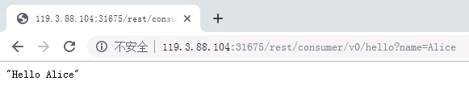


[microservice-solution]: https://github.com/servicestage-demo/microservice-solution "ServiceStage Demo: microservice-solution"
[EdgeService网关课程]: https://education.huaweicloud.com:8443/courses/course-v1:HuaweiX+CBUCNXP012+Self-paced/courseware/da725ede26794694a621b8088a858743/f840404cbae3467baf17b3ab8452ca53/ "21天转型微服务实战营： 1.6 DAY6 CSE实战之开发网关"